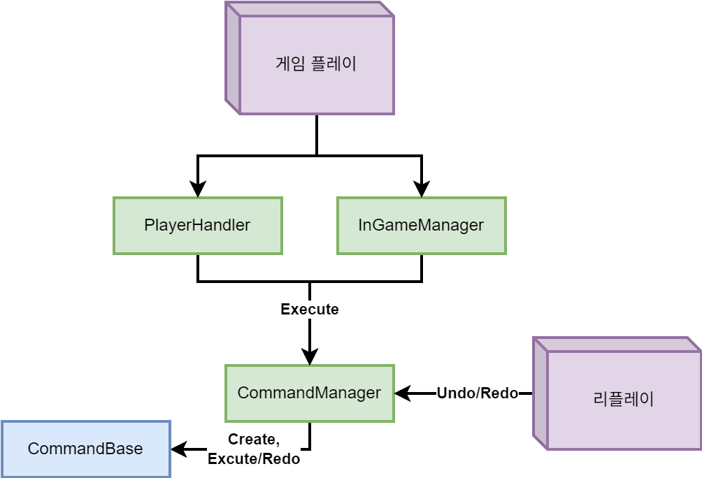

# 팀 프로젝트 - 코코두기

  

**플레이 영상:** https://youtu.be/Cl9m3anKPZ4

---

## 게임 소개

"모험심 강한 강아지, 코코두기의 집으로 돌아가는 여정기."

스테이지 별로 존재하는 맵의 기믹을 파악하고, 최소한의 행동력을 소모해서 집을 돌아가는 길찾기 퍼즐게임입니다.

---

## 🎮 프로젝트 개요

| 항목 | 내용 |
| ------ | ------ |
| **프로젝트명** | 코코두기 |
| **개발 기간** | 2025.10. ~ 2025.12. |
| **개발 인원** | 기획 4인, 개발 6인 |
| **담당 역할** | 클라이언트 조장 — 인게임 로직, 헥스 타일 시스템, 맵 에디터 |
| **개발 엔진** | Unity 6.1 (6000.1) |
| **개발 언어** | C# |
| **타겟 플랫폼** | Android |

---

## Command Pattern 플로우

  

---

## 주요 기능

### 맵 에디터 - 담당
* 타일 배치, 기물 배치, 기믹–트리거 연결, 날씨 설정을 지원하는 인게임 맵 제작 툴
* 결과는 인게임과 동일한 json으로 저장되어, 에디터 없이도 수정·생성 가능

> #### 관련 스크립트 및 폴더 링크
> * [**MapEditor/Scripts**](https://github.com/Sirosi/CocoDoogy/tree/main/Assets/_MapEditor/Scripts)
> * [MapEditorController.cs](https://github.com/Sirosi/CocoDoogy/blob/main/Assets/_MapEditor/Scripts/Controller/MapEditorController.cs)
> * [MapSaveLoader.cs](https://github.com/Sirosi/CocoDoogy/blob/main/Assets/_Project/Scripts/Utility/MapSaveLoader.cs)

 

### 파이어베이스 연동 - 공동
* Firebase의 기능을 사용하기 위한 시스템

> #### 관련 스크립트 및 폴더 링크
> * [**Network**](https://github.com/Sirosi/CocoDoogy/tree/main/Assets/_Project/Scripts/Network)
> * [FirebaseManager.cs](https://github.com/Sirosi/CocoDoogy/blob/main/Assets/_Project/Scripts/Network/FirebaseManager.cs)

 

### 인게임 처리 - 담당
* 모든 조작은 Command Pattern으로 기록되어 Undo/Redo 및 리플레이에 사용됨
* 조작 이후 시스템 처리는 Phase 체인이 순차 판정하고, 조건 미충족 시 즉시 중단
* 리플레이 json은 field 명 축약으로 약 31% 경량화

> #### 관련 스크립트 및 폴더 링크
> * [**GameFlow/InGame**](https://github.com/Sirosi/CocoDoogy/tree/main/Assets/_Project/Scripts/GameFlow/InGame)
> * [**GameFlow/InGame/Phase**](https://github.com/Sirosi/CocoDoogy/tree/main/Assets/_Project/Scripts/GameFlow/InGame/Phase)
> * [InGameManager.cs](https://github.com/Sirosi/CocoDoogy/blob/main/Assets/_Project/Scripts/GameFlow/InGame/InGameManager.cs)
> * [PlayerHandler.cs](https://github.com/Sirosi/CocoDoogy/blob/main/Assets/_Project/Scripts/GameFlow/InGame/PlayerHandler.cs)
> * [**GameFlow/InGame/Command**](https://github.com/Sirosi/CocoDoogy/tree/main/Assets/_Project/Scripts/GameFlow/InGame/Command)
> * [CommandManager.cs](https://github.com/Sirosi/CocoDoogy/blob/main/Assets/_Project/Scripts/GameFlow/InGame/Command/CommandManager.cs)

 

### 타일 및 기물 시스템 - 담당
* HexTile 1개에 기물(Piece) 최대 7개, 별도 라이프사이클(Init/Spawn/Release)로 풀링
* 이동 가능 판정은 8단계 조건 체인으로 첫 불가 사유에서 종료
* 다리 기물은 앞·뒤 타일의 회전 이벤트를 구독해 회전 후 부착 타일을 갱신

> #### 관련 스크립트 및 폴더 링크
> * [**Tile**](https://github.com/Sirosi/CocoDoogy/tree/main/Assets/_Project/Scripts/Tile)
> * [HexTile.cs](https://github.com/Sirosi/CocoDoogy/blob/main/Assets/_Project/Scripts/Tile/HexTile.cs)
> * [HexTileMap.cs](https://github.com/Sirosi/CocoDoogy/blob/main/Assets/_Project/Scripts/Tile/HexTileMap.cs)
> * [**Tile/Piece**](https://github.com/Sirosi/CocoDoogy/tree/main/Assets/_Project/Scripts/Tile/Piece)
> * [Piece.cs](https://github.com/Sirosi/CocoDoogy/blob/main/Assets/_Project/Scripts/Tile/Piece/Piece.cs)
> * [BridgePiece.cs](https://github.com/Sirosi/CocoDoogy/blob/main/Assets/_Project/Scripts/Tile/Piece/BridgePiece.cs)

 

### 기믹 시스템 - 담당
* 기믹은 타일 좌표(Vector2Int)를 키로 관리, Trigger와 n:n 연결
* 기믹 종류·타겟·연결 트리거는 맵 에디터에서 설정되어 json에 포함되므로 별도 코드 작업 불필요

> #### 관련 스크립트 링크
> * [GimmickExecutor.cs](https://github.com/Sirosi/CocoDoogy/blob/main/Assets/_Project/Scripts/Tile/Gimmick/GimmickExecutor.cs)
> * [GimmickData.cs](https://github.com/Sirosi/CocoDoogy/blob/main/Assets/_Project/Scripts/Tile/Gimmick/Data/GimmickData.cs)
> * [LeverPiece.cs](https://github.com/Sirosi/CocoDoogy/blob/main/Assets/_Project/Scripts/Tile/Piece/Trigger/LeverPiece.cs)

---

 

## Third Party Library

  
  

